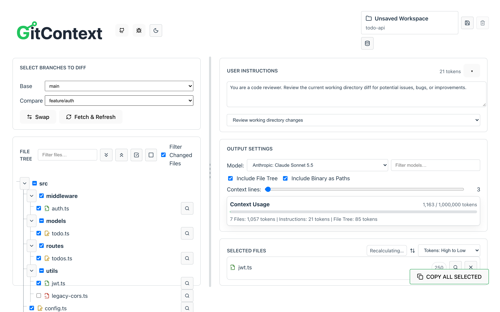
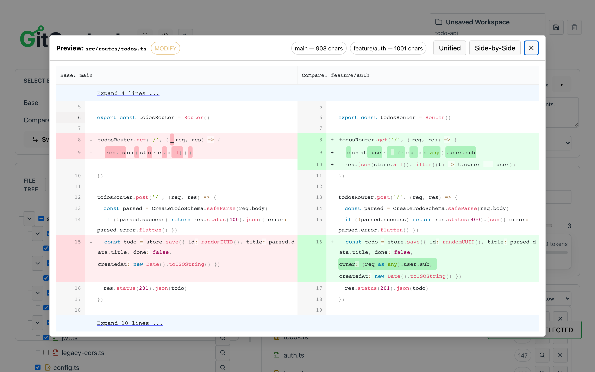
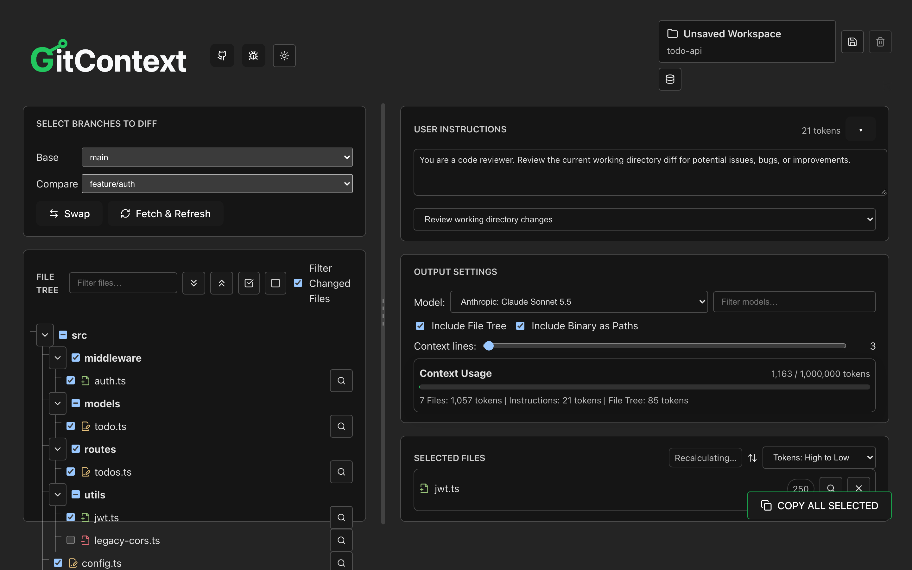
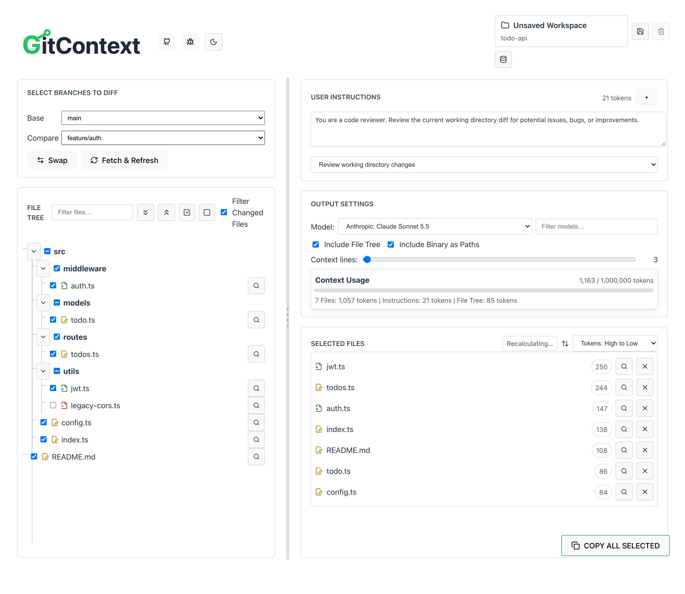
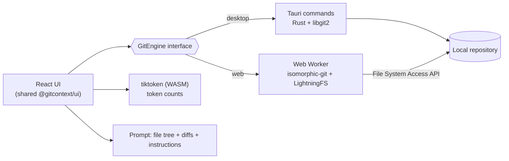

<h1 align="center">
  
  <span>GitContext</span>
</h1>

<p align="center">
  <em>100% private codebase context engineering tool<br>
  Fully local app to package your codebase files and diffs into LLM-friendly format</em>
</p>

<p align="center">
<a href="https://github.com/kccarlos/gitcontext/actions/workflows/release.yml"></a>
<a href="https://github.com/kccarlos/gitcontext/actions/workflows/pages.yml"></a>
<a href="https://github.com/kccarlos/gitcontext/releases/latest"></a>
<a href="https://github.com/kccarlos/gitcontext/blob/main/LICENSE"></a>
</p>

<p align="center">
  <a href="https://kccarlos.github.io/gitcontext/"><strong>Try it in your browser</strong></a> ·
  <a href="#install">Install</a> ·
  <a href="#how-it-works">How it works</a>
</p>

<p align="center">
  
</p>

---

**GitContext** turns the part of a repository you care about into one clean prompt for ChatGPT, Claude or any other LLM. Pick two branches, tick the files, and copy a single block with the file tree, the diffs and your instructions, with a live token count against the model's context window.

Everything runs on your machine. There is no server and no upload: the desktop app reads Git through native Rust (`libgit2`), and the web app runs Git in your browser with `isomorphic-git`.

It is similar to Repomix or GitIngest, with a few differences:

- **Branch-to-branch diffs**, not just whole files, so a review or bug fix prompt carries only what changed
- **Visual selection**: a file tree with add/modify/remove markers instead of CLI glob filters
- **Token budget up front**: per-file and total counts (tiktoken) against the selected model's context window
- **Prompt templates** for common jobs: summarize a branch diff, review changes, suggest tests, draft release notes
- **Private by construction**: local files only, no network calls for your code

## Install

### macOS (Homebrew)

```sh
brew install --cask kccarlos/tap/gitcontext
```

The cask installs the same signed and notarized universal DMG (Apple silicon and Intel) that is attached to each [GitHub release](https://github.com/kccarlos/gitcontext/releases/latest). Update with `brew upgrade --cask gitcontext`.

### Direct download

| Platform | Package |
| --- | --- |
| macOS 10.15+ | `GitContext_<version>_universal.dmg` (Developer ID signed, notarized) |
| Windows | `.msi` or `-setup.exe` |
| Linux | `.AppImage`, `.deb` or `.rpm` |

All from the [latest release](https://github.com/kccarlos/gitcontext/releases/latest).

### Web app

Open **[kccarlos.github.io/gitcontext](https://kccarlos.github.io/gitcontext/)** in Chrome or Edge (it needs the File System Access API). Nothing to install, and your code still never leaves the browser.

---

## Screenshots

These show the web app. The desktop app has the same core workflow with a native folder picker, saved workspaces and a tabbed side panel.

<table>
  <tr>
    <td width="50%"><br><sub><b>Diff preview</b>: unified or side-by-side, before you include a file.</sub></td>
    <td width="50%"><br><sub><b>Dark mode</b>, following the system or set by hand.</sub></td>
  </tr>
  <tr>
    <td colspan="2"><br><sub><b>Selected files</b> with per-file token counts, sorted by size, then one click to copy the whole prompt.</sub></td>
  </tr>
</table>

---

## How it works



- **One UI, two engines.** The React app talks to a `GitEngine` interface. In the desktop build it is backed by Tauri commands over `libgit2`; in the browser, by a Web Worker running `isomorphic-git` on an in-memory file system seeded from the `.git` folder you pick.
- **Responsive with large repositories.** Diffs and file reads run off the main thread, token counting is debounced and cancellable with bounded concurrency, and stale results are dropped by request IDs.
- **Exact token counts.** Counts are taken on the same text that is copied, so the budget shown matches what the model receives.
- **Shipping.** Conventional Commits drive semantic-release. Each release builds Windows, Linux and a universal macOS app in CI. The macOS app is signed with a Developer ID, notarized, and published to a Homebrew tap. The web app deploys to GitHub Pages after a smoke test of the production build.

---

## Why I Built It

As a developer who frequently works with ChatGPT, Claude, and other LLMs, I found existing tools lacking:

- Needed a **visual way to pick files and diffs** instead of crafting CLI filters
- Wanted **branch-to-branch diffs** for scenarios like code reviews and bug fixes
- Preferred an **interactive workflow** over command-line arguments
- Required **privacy** — no uploading code to third-party servers

Passing only relevant context to an LLM significantly improves accuracy — especially in large codebases with overlapping names and structures. See [Context Rot](https://research.trychroma.com/context-rot) for why trimming irrelevant context matters.

---

## Tech Stack

### Desktop App (Tauri)
- **Frontend**: React 18 + TypeScript + Vite
- **Backend**: Rust + Tauri 2.0
- **Git Operations**: `git2` crate (native Rust)
- **Token Counting**: `tiktoken` (WASM)

### Web App
- **Frontend**: React 18 + TypeScript + Vite
- **Git Operations**: `isomorphic-git` + LightningFS
- **Token Counting**: `tiktoken` (WASM)
- **Storage**: IndexedDB for caching

### Shared Packages (Monorepo)
- `@gitcontext/ui` - Shared React components
- `@gitcontext/core` - Shared types and utilities

---

## Getting Started

This project uses a monorepo structure with NPM workspaces.

### Prerequisites

```bash
npm install
```

### Web App

Run the web app in development mode:

```bash
npm run web:dev
```

Build the web app for production:

```bash
npm run web:build
npm run web:preview
```

The web app will be available at http://localhost:5173

### Desktop App

**Prerequisites**:
- [Rust](https://rustup.rs/) must be installed
- Platform-specific dependencies:
  - **macOS**: Xcode Command Line Tools
  - **Linux**: `libwebkit2gtk-4.1-dev`, `libappindicator3-dev`, `librsvg2-dev`, `patchelf`
  - **Windows**: Microsoft Visual C++ Build Tools

Run the desktop app in development mode:

```bash
npm run desktop:dev
```

Build the desktop app for production:

```bash
npm run desktop:build
```

Installers will be created in `apps/desktop/src-tauri/target/release/bundle/`. Release builds are signed and notarized in CI (`.github/workflows/release.yml`).

### Testing

Run end-to-end tests:

```bash
npm --workspace apps/web run test:e2e
```

Run unit tests:

```bash
npm --workspace apps/web run test:unit
npm --workspace apps/desktop run test
cd apps/desktop/src-tauri && cargo test
```

Smoke test the production web build as GitHub Pages serves it (under `/gitcontext/`):

```bash
npm --workspace apps/web run build
npm --workspace apps/web run test:pages
```

---

## Project Structure

```
gitcontext/
├── apps/
│   ├── web/              # Web application (React + isomorphic-git)
│   │   ├── src/
│   │   │   ├── components/
│   │   │   ├── hooks/
│   │   │   ├── workers/
│   │   │   └── utils/
│   │   └── vite.config.ts
│   └── desktop/          # Desktop application (Tauri + Rust)
│       ├── src/          # React frontend
│       └── src-tauri/    # Rust backend
│           ├── src/
│           │   ├── git.rs    # Git operations (git2)
│           │   └── lib.rs    # Tauri commands
│           └── Cargo.toml
├── packages/
│   ├── ui/               # Shared React components
│   └── core/             # Shared types and utilities
└── package.json          # Root workspace config
```

---

## Development Scripts

| Command | Description |
|---------|-------------|
| `npm run web:dev` | Start web app dev server |
| `npm run web:build` | Build web app for production |
| `npm run desktop:dev` | Start desktop app in dev mode |
| `npm run desktop:build` | Build desktop app installers |
| `npm run lint` | Lint all workspaces |
| `npm run build` | Build all workspaces |

---

## Contributing

Contributions are welcome! Please feel free to submit a Pull Request.

---

## License

This project is licensed under the MIT License - see the [LICENSE](LICENSE) file for details.

---

## Acknowledgments

- [isomorphic-git](https://isomorphic-git.org/) for browser-based Git operations
- [git2-rs](https://github.com/rust-lang/git2-rs) for native Rust Git operations
- [Tauri](https://tauri.app/) for the native desktop framework
- [tiktoken](https://github.com/openai/tiktoken) for token counting

---

<p align="center">
  Made with ❤️ by <a href="https://github.com/kccarlos">kccarlos</a>
</p>
